# Bookzy

Android E-book Reader Application by Kotlin  
Mobile Programming Course Project  
Winter 2022  

## Screenshots
intro:  
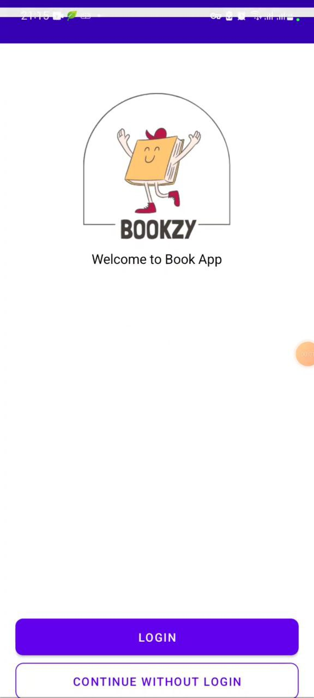  
login:  
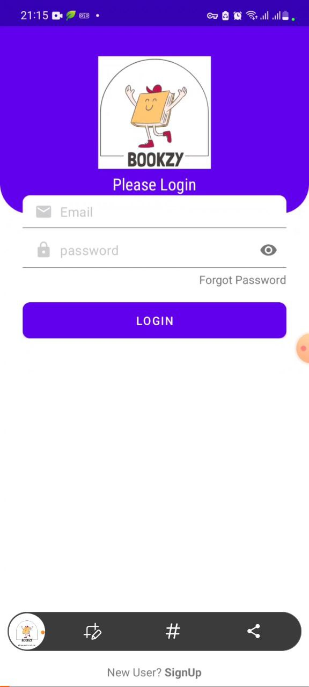  
dashboard:  
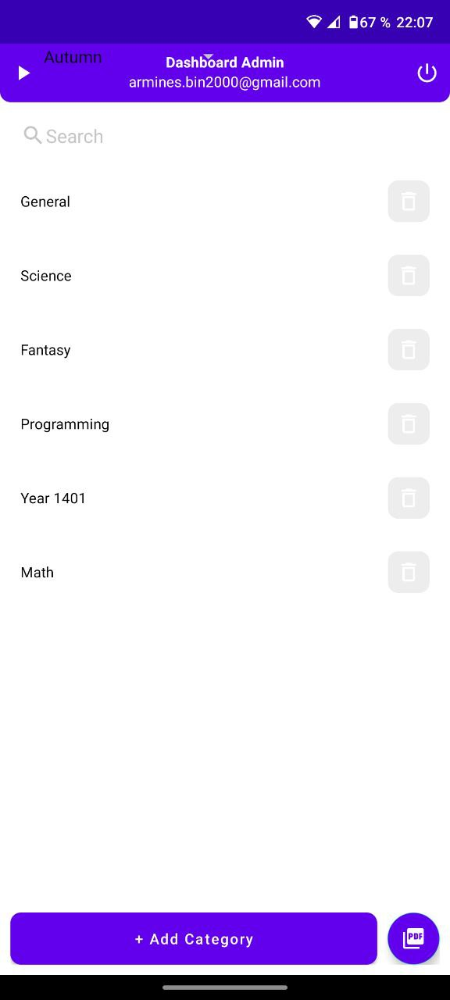  
music player:  
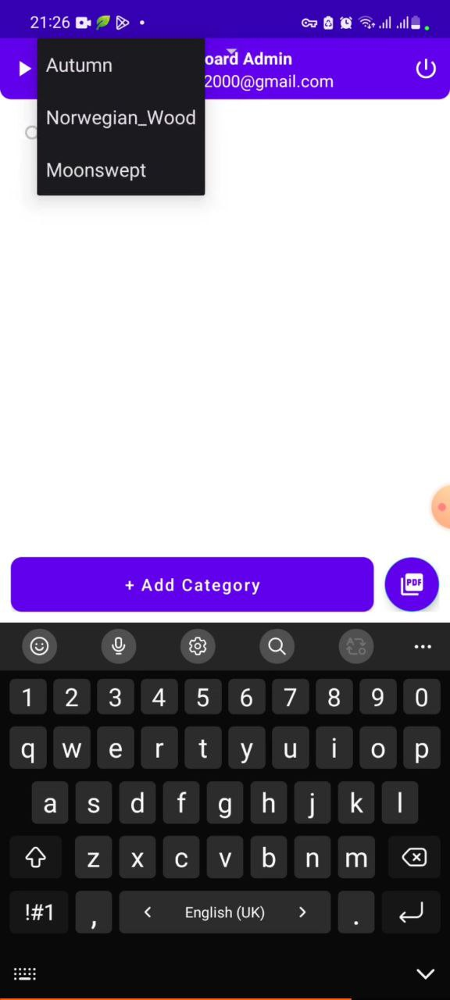  
book menu:  
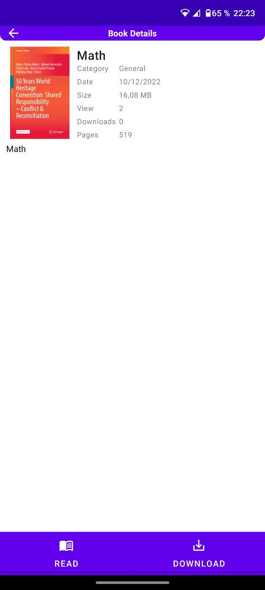  
add a new book:  
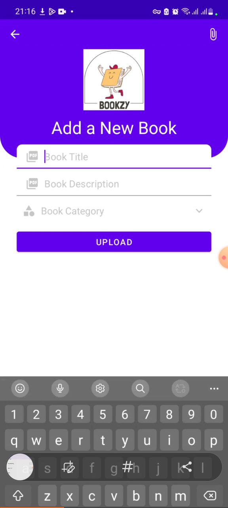  
add a new category:  
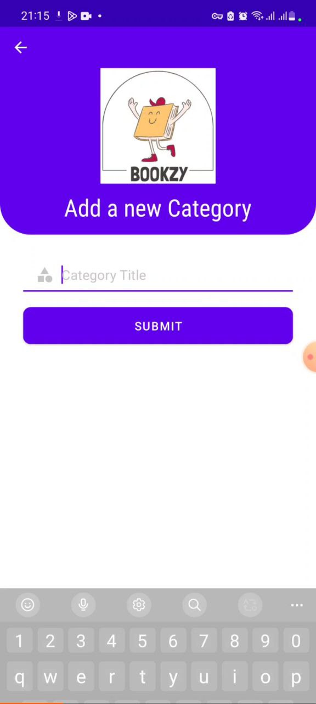  
pen feature:  
  
highlight feature:  
  
viewing mode:  
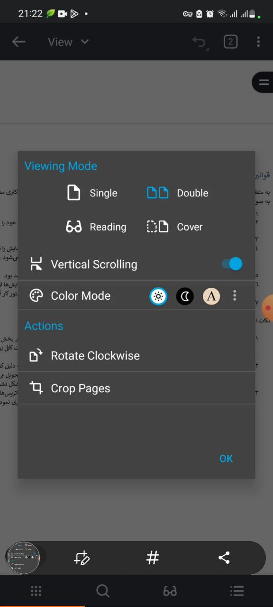  
reading options:  
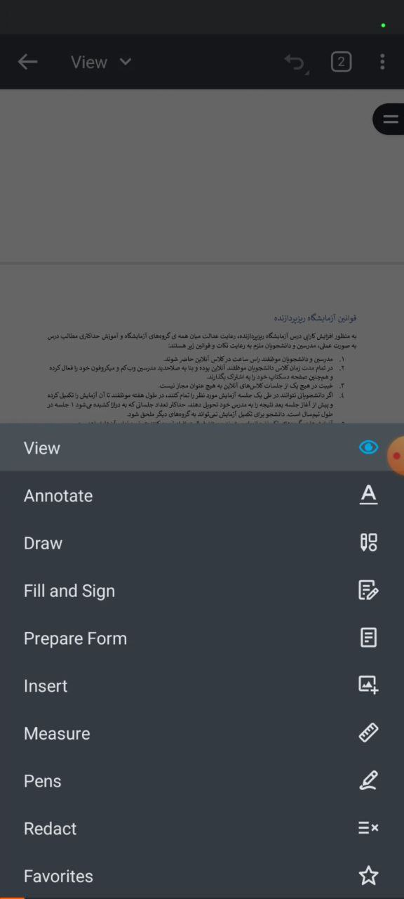  
customize reader:  
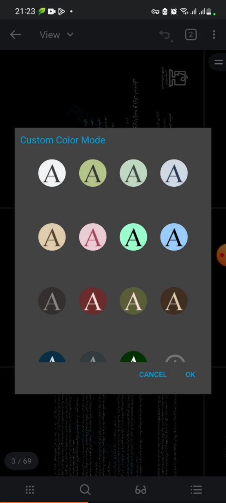  
save book:  
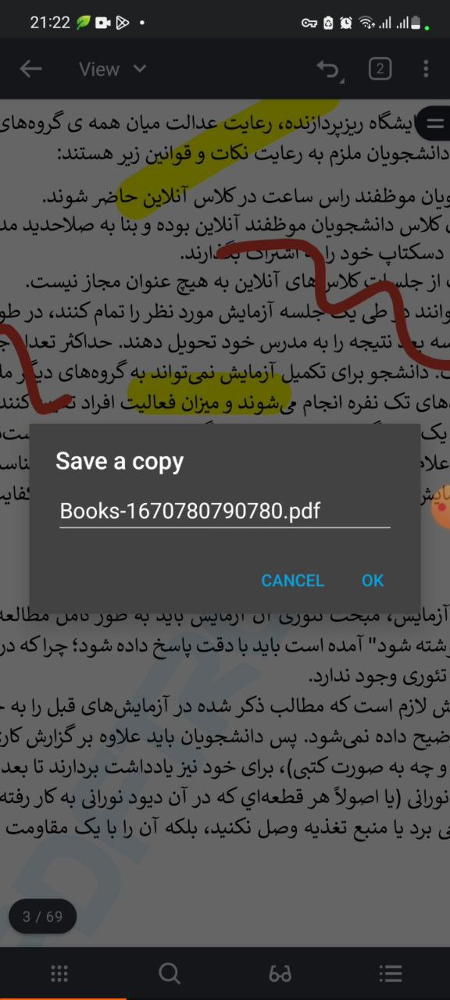  
annotations:  
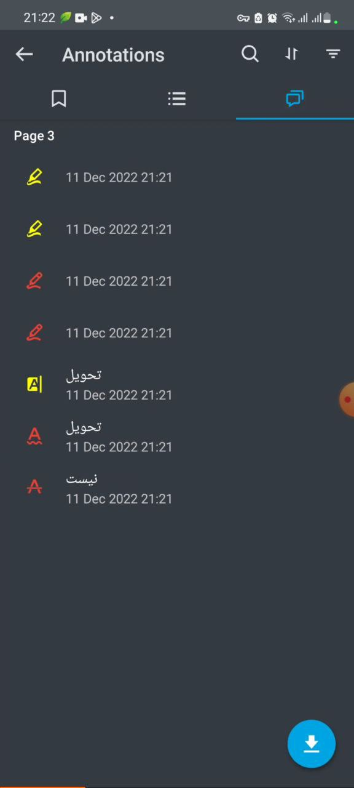  
